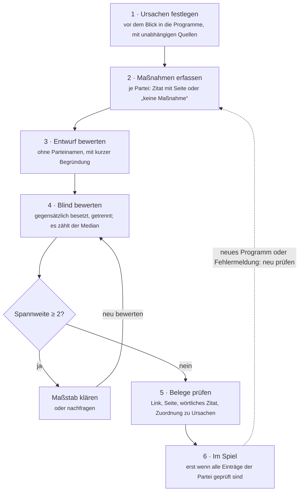

# Politik-Duell – Methodenpapier

Stand: 28. 9. 2026

*Versprechen kann jeder.* Das Politik-Duell vergleicht Parteien daran, ob sie für reale Alltagsprobleme wirksame und umsetzbare Lösungen anbieten – nach denselben Regeln für alle und mit Beleg für jede Bewertung.

## Worum es geht

Das Politik-Duell ist ein Spiel für zwei Personen. Jede wählt eine Partei. In fünf Runden nennen beide abwechselnd ein Problem aus ihrem Alltag, etwa „Ich finde keinen Facharzttermin“ oder „Meine Miete frisst mein halbes Gehalt“. Das Spiel zeigt dann, welche der beiden Parteien dafür die wirksamere und umsetzbare Lösung im Programm hat. Zu jeder Bewertung gibt es den Beleg: einen Link auf die Seite im Wahlprogramm.

Das Ziel: Politik an dem messen, was sie für konkrete Probleme vorschlägt, nicht an Versprechen, Sympathie oder Lautstärke. Das Spiel ist keine Wahlempfehlung und kein Gesamturteil über eine Partei.

## Grundprinzipien

Fünf Regeln gelten ohne Ausnahme:

1. **Neutrale Methode, kein vorgegebenes Ergebnis.** Alle Parteien werden nach denselben Kriterien bewertet. Bietet eine Partei nachweislich die beste Lösung, gewinnt sie – egal welche.
2. **Die KI vergibt keine Punkte.** Sie führt nur das Gespräch und ordnet ein Problem einem Thema und seinen Ursachen zu. Die Punkte kommen immer aus einer geprüften Datenbank.
3. **Jede Bewertung hat einen Beleg.** Quellen und Links stammen nur aus der Datenbank, die KI erfindet keine. Jede Maßnahme ist mit wörtlichem Zitat und Seitenangabe im Wahlprogramm belegt.
4. **Forderung ist nicht gleich Problem.** Sagt jemand „weniger X“, fragt das Spiel nach dem konkreten Alltagsproblem dahinter. Bewertet wird die Lösung für das Problem, nicht die Forderung.
5. **Datenschutz.** Politische Meinungen sind besonders geschützte Daten (Art. 9 DSGVO). Es gibt keine Konten, es werden keine IP-Adressen und keine Sprachaufnahmen gespeichert, nur der anonyme Problemtext.

## Datengrundlage

Grundlage sind die Wahlprogramme zur Bundestagswahl 2025 von sieben Parteien. Neuere Grundsatzprogramme gibt es bisher nicht (Stand September 2026); kommt eines hinzu, werden alle älteren Einträge der Partei neu geprüft.

| Partei | Wahlprogramm | Beschluss |
| --- | --- | --- |
| CDU/CSU | [Politikwechsel für Deutschland](https://www.cdu.de/app/uploads/2025/01/km_btw_2025_wahlprogramm_langfassung_ansicht.pdf) | 17. 12. 2024 |
| SPD | [Mehr für Dich. Besser für Deutschland.](https://www.spd.de/fileadmin/Dokumente/Beschluesse/Programm/2025_SPD_Regierungsprogramm.pdf) | 11. 1. 2025 |
| Bündnis 90/Die Grünen | [Zusammen wachsen](https://cms.gruene.de/uploads/assets/20250318_Regierungsprogramm_DIGITAL_DINA5.pdf) | 26. 1. 2025 |
| FDP | [Alles lässt sich ändern](https://www.fdp.de/sites/default/files/2024-12/fdp-wahlprogramm_2025.pdf) | 9. 2. 2025 |
| AfD | [Zeit für Deutschland](https://www.afd.de/wp-content/uploads/2025/02/AfD_Bundestagswahlprogramm2025_web.pdf) | 12. 1. 2025 |
| Die Linke | [Alle wollen regieren. Wir wollen verändern.](https://www.die-linke.de/fileadmin/user_upload/Wahlprogramm_Langfassung_Linke-BTW25_01.pdf) | 18. 1. 2025 |
| BSW | [Unser Land verdient mehr!](https://bsw-vg.de/wp-content/themes/bsw/assets/downloads/BSW%20Wahlprogramm%202025.pdf) | 12. 1. 2025 |

### Themen: was Menschen selbst nennen

Welche Themen ins Spiel kommen, richtet sich nach den meistgenannten Problemen in Umfragen vor den Landtagswahlen 2026 in Sachsen-Anhalt, Mecklenburg-Vorpommern und Berlin – nicht nach den Schwerpunkten einzelner Parteien. Daraus ergeben sich zehn Themen: Arzttermine, Miete, Energiepreise, Schule, Arbeitsplätze, Zuwanderung und Integration, Rente, Bus und Bahn, Sicherheit, Pflege. Details: [`daten/README.md` → Themenauswahl](../daten/README.md#themenauswahl).

### Ursachen: festgelegt, bevor jemand in die Programme schaut

Jedes Thema hat ein **Ziel aus Sicht der Betroffenen** (Miete: „Mieterinnen und Mieter finden eine passende Wohnung und können sich die Miete dauerhaft leisten.“) und eine Liste von **Ursachen**, warum das Problem besteht. Jede Ursache braucht eine unabhängige Quelle, etwa Statistisches Bundesamt, Sachverständigenräte, IAB, DIW oder BKA. Parteiquellen sind ausgeschlossen, Lobbyverbände nie als einzige Quelle.

Die Ursachen werden in einem eigenen Schritt festgelegt, **bevor** Maßnahmen aus den Programmen erfasst werden. So kann niemand die Ursachen passend zu einem Programm zuschneiden.

### Maßnahmen: für jede Partei, mit Zitat

Für jede Partei und jedes Thema gibt es genau einen von zwei Einträgen:

- **Maßnahmen**, die an einer der Ursachen ansetzen, jeweils mit wörtlichem Zitat und Seitenanker im Programm (z. B. `…wahlprogramm.pdf#page=17`), oder
- **„keine Maßnahme“**, mit Angabe, welche Kapitel durchsucht wurden.

Alle Daten liegen offen als Dateien im Quellcode ([`daten/`](../daten/README.md)). Änderungen sind nachvollziehbar und brauchen immer eine Quelle; eine automatische Prüfung kontrolliert Pflichtfelder, Wertebereiche und dass jeder Beleg ins Programm der richtigen Partei zeigt.

## Bewertung

Jede Maßnahme bekommt zwei Werte von 0 bis 3. Ihre Punkte sind das Produkt, also 0 bis 9:

> Punkte = Wirksamkeit × Umsetzbarkeit

Das Produkt ist Absicht: Eine Maßnahme ohne Wirkung bringt keine Punkte, auch wenn sie leicht umzusetzen wäre – und eine wirksame, die sich nicht umsetzen lässt, ebenso wenig.

| Wert | Wirksamkeit: Wie stark hilft sie den Betroffenen? | Umsetzbarkeit: Ist sie realistisch? |
| --- | --- | --- |
| 0 | hilft nicht: setzt an keiner der erfassten Ursachen an | rechtlich oder finanziell derzeit nicht umsetzbar (z. B. verfassungs- oder EU-rechtswidrig) |
| 1 | hilft kaum: berührt eine Ursache nur am Rand oder lindert nur Folgen | nur mit großen Hürden (z. B. Verfassungsänderung, ungeklärte Finanzierung) |
| 2 | hilft spürbar: setzt an einer Ursache an, deutliche Verbesserung zu erwarten | umsetzbar mit Aufwand oder in mehreren Jahren |
| 3 | hilft stark: setzt direkt an einer Hauptursache an, Wirkung gut belegt | rechtlich möglich, finanziert, in einer Wahlperiode realistisch |

Wirksamkeit misst den Beitrag zum Ziel der Betroffenen; Vor- und Nachteile für andere Gruppen zählen hier nicht. Umsetzbarkeit fragt, ob eine Bundesregierung die Maßnahme in einer Wahlperiode rechtlich und finanziell umsetzen könnte. Ob sie politisch mehrheitsfähig ist, spielt keine Rolle. Zu jeder Bewertung gehört eine Begründung in ein bis zwei neutralen Sätzen: was dafür, was dagegen spricht.

**Rollen.** Spielende können eine Rolle wählen: Mieter:in, Eigentümer:in, angestellt, selbstständig, Rentner:in, arbeitslos, studierend, vermögend. Wirkt eine Maßnahme für eine Rolle nachweislich deutlich besser oder schlechter, verschiebt sich ihre Wirksamkeit um bis zu zwei Stufen (innerhalb 0 bis 3). Jede solche Verschiebung ist einzeln begründet und wird angezeigt.

### Punkte in der Runde

1. Pro Ursache zählt die beste Maßnahme einer Partei.
2. Die Rundenpunkte sind die Summe über alle Ursachen, denen das Problem zugeordnet wurde.
3. Die höhere Summe bekommt den Spielpunkt, bei Gleichstand beide.
4. Nach fünf Runden gewinnt, wer mehr Spielpunkte hat. Zusätzlich zeigt jede Runde, welche aller sieben Parteien die beste Lösung hätte.

### Sonderfälle

| Lage in der Datenbank | Anzeige im Spiel | Punkte |
| --- | --- | --- |
| Maßnahme zu den Ursachen vorhanden, geprüft | Maßnahme mit Bewertung, Begründung und Belegen | nach Bewertung |
| Maßnahmen zum Thema, aber keine zu diesen Ursachen | „keine Maßnahme zu diesen Ursachen“ | 0 |
| Programm enthält nichts zum Thema, geprüft | „nichts zum Thema im Programm“ + was durchsucht wurde | 0 |
| Thema für diese Partei noch nicht vollständig geprüft | „noch nicht erfasst“ | Runde wird nicht gewertet |
| Thema gar nicht in der Datenbank | „ungeprüft – keine Wertung“, ohne Links; kommt in die Warteschlange für neue Themen | keine |
| Spieler:in nennt einen Wert oder eine Haltung | wird respektvoll als persönliche Haltung benannt; neues Problem möglich | keine |

0 Punkte heißt nur: Im Wahlprogramm mit dem angegebenen Stand steht dazu nichts – nicht, dass sich die Partei nie dazu geäußert hätte. Fehlende Daten kosten keine Partei einen Punkt.

## Rolle der KI

Die KI ist Übersetzerin, nicht Schiedsrichterin. Sie macht aus einem frei formulierten Satz eine Zuordnung zu Thema und Ursachen – mehr nicht.

| Die KI … | Die KI … nicht |
| --- | --- |
| erkennt, ob ein Problem, eine Forderung oder eine Haltung genannt wurde | vergibt Punkte |
| stellt bei Forderungen höchstens zwei Nachfragen nach dem Alltagsproblem | nennt Quellen oder Links |
| ordnet das Problem einem Thema und dessen Ursachen zu | bewertet Parteien oder äußert sich zu ihnen |
| fasst das Problem in einem neutralen Satz zusammen | belehrt oder kommentiert Meinungen |

Technisch abgesichert: Die KI antwortet in einem festen Format, die Antwort wird geprüft (nur IDs aus dem Katalog, keine Links), Parteinamen in KI-Texten werden entfernt. Die Punkte berechnet ein festes Programm aus der Datenbank – dieselbe Eingabe ergibt immer dasselbe Ergebnis.

## Prüfverfahren

Eine Bewertung zählt erst, wenn Prüfende aus gegensätzlichen Perspektiven sie unabhängig voneinander bewertet haben und alle Belege kontrolliert sind. Bis dahin zeigt das Spiel „noch nicht erfasst“.

- **Gegensätzlich besetzt:** Für jedes Thema legen wir vorab zwei gegensätzliche Perspektiven fest, etwa bei Miete die Mieterseite und die Vermieter- und Bauseite. Aus beiden bewerten gleich viele Personen, möglichst ergänzt um eine Person aus der Wissenschaft ohne Bindung an eine Seite. So hebt sich die Schlagseite einzelner Prüfender im Median auf, statt sich zu addieren.
- **Ausgewählt nach Tätigkeit, nicht nach Gesinnung:** Wer zu welcher Perspektive gehört, ergibt sich aus Beruf, Institution oder Veröffentlichungen. Nach Parteimitgliedschaft oder Wahlabsicht fragen wir nicht. Abgeordnete sowie Amtsträger:innen und Beschäftigte von Parteien und Fraktionen bewerten nicht.
- **Nicht nur aus dem eigenen Umfeld:** Je Thema gewinnen wir mindestens eine prüfende Person über eine Organisation oder Hochschule, nicht über den Bekanntenkreis der Initiatorin.
- **Blind bewerten:** Die Prüfenden sehen keine Parteinamen, die Maßnahmen kommen in gemischter Reihenfolge, und niemand sieht die Werte der anderen. Den Entwurf mit Begründung sehen sie erst nach ihrer eigenen Bewertung.
- **Median statt Mittelwert:** Je Maßnahme zählt der Median, getrennt für Wirksamkeit und Umsetzbarkeit. Einzelne Ausreißer verschieben das Ergebnis so kaum.
- **Streit wird geklärt, nicht gemittelt:** Liegen zwei Einschätzungen zwei oder mehr Stufen auseinander, wird der Maßstab geklärt, bevor Werte übernommen werden.
- **Namen nur mit Einwilligung:** Prüfende werden öffentlich nur genannt, wenn sie zustimmen; sonst heißt es „von n unabhängigen Prüfenden“. Aus welchen Perspektiven wie viele Personen ein Thema bewertet haben, steht immer dabei.
- **Korrigierbar:** Fehler kann jede Person melden, mit Link auf die Stelle im Programm. Parteien können ihre Einträge jederzeit prüfen und eine Stellungnahme schicken.

## Grenzen der Methode

Die Methode ist so fair wie möglich, aber nicht fehlerfrei. Wir benennen ihre Grenzen offen:

- **Programme sind nicht Politik.** Bewertet wird, was im Wahlprogramm steht, nicht was eine Partei im Parlament oder in einer Regierung tatsächlich getan hat.
- **Bewerten bleibt Urteil.** Wirksamkeit und Umsetzbarkeit sind Einschätzungen. Blinde Prüfung, gegensätzlich besetzte Prüfende, Median und offene Begründungen machen sie nachvollziehbar, aber nicht objektiv. Die Blindbewertung hat Lücken: Manche Maßnahmen erkennt man am Inhalt – umso wichtiger ist die gegensätzliche Besetzung.
- **Die Ursachenliste prägt das Ergebnis.** Welche Ursachen ein Thema hat, entscheidet mit, welche Maßnahmen zählen. Deshalb werden sie vorab mit unabhängigen Quellen festgelegt und nur in begründeten Ausnahmen ergänzt.
- **Ein Spiel ist ein Ausschnitt.** Es deckt fünf Probleme ab und ist kein Gesamturteil über eine Partei – und keine Wahlempfehlung.
- **Die KI kann falsch zuordnen.** Deshalb zeigt jede Runde, welchem Thema und welchen Ursachen das Problem zugeordnet wurde, damit Spielende es nachprüfen können.

## Stand und Mitmachen

Die App läuft als spielbarer Prototyp mit Spracheingabe, KI-Zuordnung, Wortwolke und Datenschutz. Bis Methode und Daten belastbar sind, ist das Politik-Duell eine **geschlossene Beta**: Wir zeigen es Prüfenden, Partnerorganisationen und Testgruppen mit echten Parteinamen, bewerben es aber nicht öffentlich. Die Daten sind im Aufbau:

| Baustein | Stand September 2026 |
| --- | --- |
| Parteien und Programme | 7 Parteien, Wahlprogramme 2025 erfasst |
| Themen mit belegten Ursachen | 10 Themen |
| Maßnahmen erfasst | Miete, alle 7 Parteien (noch ungeprüft) |
| Geprüft und im Spiel | noch keine – das Prüfverfahren startet mit dem Thema Miete |

Wir suchen:

- **Prüfende mit Fachwissen** zu einem der zehn Themen, z. B. Wohnen, Gesundheit, Energie, Rente – ausdrücklich aus unterschiedlichen, auch gegensätzlichen Perspektiven. Aufwand: etwa 20–30 Minuten je Thema, in der App, ohne Konto.
- **Partnerorganisationen**, die die Methode fachlich begleiten, das Spiel in ihren Netzwerken bekannt machen oder es in der politischen Bildung einsetzen.
- **Hinweise auf Fehler** in Maßnahmen, Zitaten oder Ursachen, immer mit Link auf die Quelle.

**Initiatorin:** [Name], [E-Mail]
